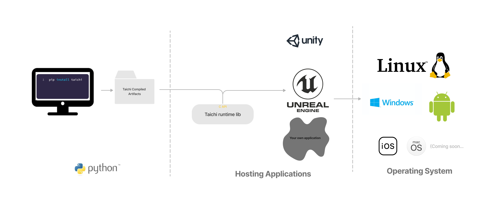
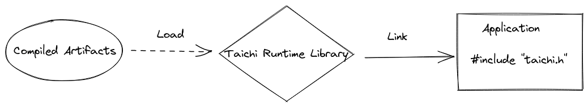

# Tutorial: Embedding Taichi in C++ application

As Python becomes the de facto language for a wide variety of areas like scientific computation, image processing and deep learning, deploying alogirthms written in Python in production is now a common challenge for many industries. Taichi's Python frontend provides easy-to-write syntax which makes writing performant parallel code really simple. And Taichi also offers a runtime library (TiRT) and C interface so that kernels written in Python can be embedded into a real application. In this tutorial, we'll walkthrough the steps to deploy a Taichi program in an C++ application.

## Overview



Since TiRT provides a C interface, technically you can embed it in any environment that can interop with C and deploy on any hardware. There're just two steps from a high level:

- Save compiled Taichi kernels in Python
- Load and run them in the hosting application using TiRT.

Let's break them down into smaller pieces:

TODO: add a picture of overall workflow

## 1. Find out the kernels to deploy

Suppose that you're given a buffer with any length, the task is to first initialize the buffer as zeros and then add `base` value to all of its elements. Let's first write the kernels in Taichi:

```
@ti.kernel
def init(x: ti.types.ndarray(field_dim=1)):
    for i in x:
        x[i] = 0

@ti.kernel
def add_base(x: ti.types.ndarray(field_dim=1), base: ti.f32):
    for i in range(x.shape[0]):
        x[i] += base
```

Kernel `init` is called only once but the `add_base` logic maybe called multiple times:

```
x = ti.ndarray(ti.f32, shape=(8192)) 
init(x)

N_ITER = 50
for _ in range(N_ITER):
    add_base(x, 0.1)
```

## 2. Save compiled artifacts on disk

A compile taichi kernel consists of all compiled artifacts when compiling a `ti.kernel` with the types of its parameters. Take kernel `add_base` as an example, argument `base`'s type is `ti.f32`. Its type information is used to compile the kernel and thus encoded in the compiled artifact, while it can be called with any floating point number at runtime.

```
mod = ti.aot.Module(ti.vulkan)
mod.add_kernel(init, template_args={'x': x})
mod.add_kernel(add_base, template_args={'x': x})
mod.save(target_dir, '')
```

`ti.types.ndarray` is a bit more complicated since it's a type templated on ndarray's `dtype` and `ndim`. If you call `add_base` twice in Python, one with an ti.ndarray of `dtype=ti.i32` and the other of `dtype=ti.math.vec2`, Taichi actually just-in-time compiles two kernels for you. As a result, Taichi won't be able to compile in AOT mode if ndarray's `dtype` or `ndim` is unknown, you'll have to supply that information either directly in the type annotation, or provide an example input via `template_args`.

Let's take a look at the generated artifacts and its layout:

```
// FUTURE WORK: This is just a zip. Replace tcb with readable JSON
// Structure of compiled artifacts
.
├── demo
│   ├── add_base_c78_0_k0001_vk_0_t00.spv
│   ├── init_c76_0_k0000_vk_0_t00.spv
│   ├── metadata.json
│   └── metadata.tcb
└── demo.py
```

## 3. Get Taichi Runtime Library (TiRT)



Alright, you are now done with Python and well prepared to build your application! The compiled artifacts we just saved and TiRT are all you need.

For now TiRT is shipped along with `taichi-nightly` Python wheels. Be aware that there's no strong version compatibility enforced yet, so it's highly recommended to use the python taichi and TiRT built from exactly the same commit.

TODO: We'll figure out a proper way to release it once the versioning issue is improved.

```
# Install python taichi: 
pip install -i https://pypi.taichi.graphics/simple/ taichi-nightly
# Get the runtime library:
pip download --no-deps -i https://pypi.taichi.graphics/simple/ taichi-nightly
# For example
unzip taichi_nightly-1.3.0.post20221102-cp38-cp38-manylinux_2_27_x86_64.whl
export TAICHI_C_API_INSTALL_DIR=$PWD/taichi_nightly-1.3.0.post20221102.data/data/c_api/lib
```

Currently, only TiRT for Linux systems is included in the nightly distributions. If you need one for Android / Windows, please see the FAQ below to build it from source.

Then add `TiRT` to your CMakeLists.txt:

```
# Find built taichi C-API library in `TAICHI_C_API_INSTALL_DIR`.
find_library(taichi_c_api taichi_c_api HINTS ${TAICHI_C_API_INSTALL_DIR}/lib NO_CMAKE_FIND_ROOT_PATH)
if (NOT EXISTS ${taichi_c_api})
    message(FATAL_ERROR "Couldn't find C-API library in ${TAICHI_C_API_INSTALL_DIR}")
endif()

# Make sure your target is properly linked!
set(TAICHI_TUTORIAL_DEMO_NAME "0_tutorial_kernel")
message("-- Building ${TAICHI_TUTORIAL_DEMO_NAME}")
add_executable(${TAICHI_TUTORIAL_DEMO_NAME} ${CMAKE_CURRENT_SOURCE_DIR}/app.cpp)
target_include_directories(${TAICHI_TUTORIAL_DEMO_NAME} PUBLIC ${TAICHI_C_API_INSTALL_DIR}/include)
target_link_libraries(${TAICHI_TUTORIAL_DEMO_NAME} ${taichi_c_api})
```

## 4. Run taichi kernels in your application

TiRT provides a C interface to maximize portability, as well as a light-weight C++ wrapper to save you from writing verbose C code. C++ wrapper is used in this tutorial for simplicity.

Calling Taichi in C++ as easy as what you'd imagine:

- Create a Taichi runtime with target arch
- Load the compiled artifacts on disk through TiRT's `load_aot_module` interface.
- Load kernels from the module to `k_init_` and `k_add_base_`
- Prepare the inputs: ndarray `x_` and float `base`
- Launch the kernels!

A complete C++ application with embedded Taichi is shown below:

```
#include <taichi/cpp/taichi.hpp>

struct App0_tutorial {
  static const uint32_t NPARTICLE = 8192 * 2;
  static const uint32_t N_ITER = 50;

  ti::Runtime runtime_;
  ti::AotModule module_;
  ti::Kernel k_init_;
  ti::Kernel k_add_base_;
  ti::NdArray<float> x_;

  App0_tutorial() {
    runtime_ = ti::Runtime(TI_ARCH_VULKAN);
    module_ = runtime_.load_aot_module("0_tutorial_kernel/assets/tutorial");
    k_init_ = module_.get_kernel("init");
    k_add_base_ = module_.get_kernel("add_base");
    x_ = runtime_.allocate_ndarray<float>({NPARTICLE}, {}, true);
    std::cout << "Initialized!" << std::endl;
  }

  bool run() {
    float base = 0.2;

    k_init_.push_arg(x_);
    k_init_.launch();
    k_add_base_.push_arg(x_);
    k_add_base_.push_arg(base);
    for (int i = 0; i < N_ITER; i++) {
      k_add_base_.launch();
    }
    runtime_.wait();
    return true;
  }
};

int main(int argc, const char** argv) {
  App0_tutorial app;
  app.run();
  return 0;
}
```

# FAQ

## Map your Taichi data types from Python to C++

| Python | C++ |
| --- | --- |
| scalar | C++ scalar type |
| ti.vector / ti.matrix | std::vector |
| ti.ndarray | ti::Ndarray |
| ti.Texture | ti::Texture |
| ti.field   | WIP         |

## Does Taichi support device import/export?

Yes! We understand that in real applications it's pretty common to hook Taichi in your existing Vulkan pipeline. As a result, you can choose to import an external device for Taichi to use, or export a device that Taichi creates to share with the external application

```
// TODO: add an example
```

## Which backends & hardware are supported?

Currently `ti.vulkan`, `ti.opengl`, `ti.x86` and `ti.cuda` are supported. `ti.metal` is not yet supported.

## How can I debug a C++ application with embedded Taichi?

1. Check ti_get_last_error() whenever you call a Taichi C API.
2. Enable backward-cpp in your application to locate the source of crashes. E.g. <https://github.com/taichi-dev/taichi-aot-demo/pull/69>
3. Get values of ndarrays back on host using ndarray.read(), e.g. <https://github.com/taichi-dev/taichi-aot-demo/pull/57/files#diff-d94bf1ff63835d9cf87e700ca3c37d1e9a3c09e5994944db2adcddf132a71d0cR32>
4. Enable printing in shaders, e.g. <https://github.com/taichi-dev/taichi-aot-demo/pull/55>

## Does Taichi support generating shaders for different deployment targets?

Yea, it's a common feature request that people want to generate shaders for their Android application on a Linux desktop. If you know exactly what your target device is capable of, you can specify in the ti.aot.Module(arch=, caps=[]). Some example caps are spirv_has_atomic_float, spirv_has_physical_storage_buffer etc.

Supporting compiling to an arch different from the one in ti.init() is a planned feature but not yet supported.

## Are Taichi compiled artifacts versioned?

(Pre-release version, until JSON is resolved)

We highly recommend using python taichi and C++ taichi runtime built from exactly the same commit.

## Can I hook Taichi into a render pipeline?

Yes! If you already have a rendering pipeline, you can interop with Taichi via <https://docs.taichi-lang.org/docs/taichi_vulkan>.

If you don't have one already, please check out our demos at <https://github.com/taichi-dev/taichi-aot-demo>

## I just want to use raw shaders generated by Taichi. Where can I find them?

Yea you can find it in the target folder of aot save. But please be aware that launching Taichi shaders requires some special setup which relates to implementation details in Taichi and may subject to change without notice.

But if you have super strict size limitation for the whole application where the provided runtime is too large to fit, you may consider writing a minimal taichi runtime in C which consumes those raw shaders.

## Can I build the libtaichi_c_api.so from source?

Usually, for simplicity and stability, we recommend using the official nightly taichi wheels and the c_api shipped inside the wheel. But if you want a runtime library with special build configuration:

```
TAICHI_CMAKE_ARGS="-DTI_WITH_VULKAN:BOOL=ON -DTI_WITH_C_API:BOOL=ON" python setup.py develop

# Other commonly used CMake options
- TI_WITH_OPENGL
- TI_WITH_CPU
- TI_WITH_CUDA
```

You can find the built `libtaichi_c_api.so` and its headers in the `_skbuild/` folder.

// TODO: Android / Windows

## Taichi/C API Reference Manual

<https://docs.taichi-lang.org/docs/taichi_core#api-reference>

// TODO: we also need documentation for C++ wrapper, in the ideal case...

## When do I need to recompile my artifacts?

You should recompile the artifacts when the following happens:

- Kernels and their launching logic in Python are updated
- You need a newer version for either Python Taichi or runtime library.
- Your target device has a different set of capabilites
- If you update some Python constants (instead of kernel arguments), they're likely encoded as a constant in Taichi compiled artifacts so you'll need a recompilation.

Note given the nature of how Ndarrays are handled in the Taichi compilation, shaders generated can be used for ndarrays with different shapes as long as their ranks match. Which really comes to handy if you need one set of shaders for everything, e.g. different screen sizes on Android phones.

## How can I set values for ndarrays in C++?

In the C++ wrapper we provide these convenient read/write() methods on NdArray class. <https://github.com/taichi-dev/taichi/blob/master/c_api/include/taichi/cpp/taichi.hpp#L192-L215>

In C API you can allocate your memory as host accessible and then use map/unmap. <https://docs.taichi-lang.org/docs/taichi_core>
